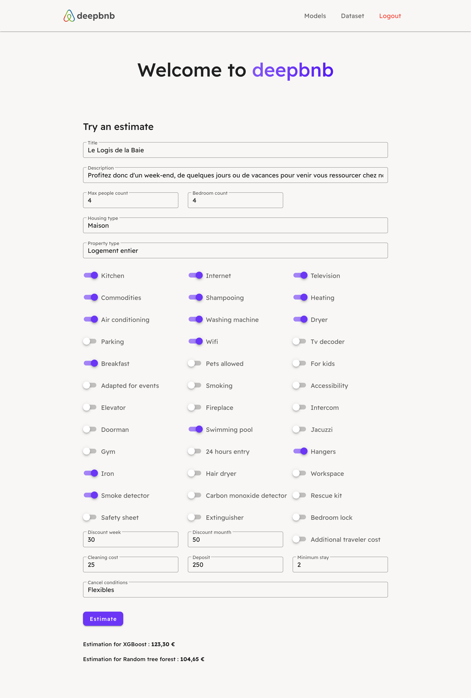

# Deepbnb

This application was realized at Télécom Saint-Étienne for the big data project course.

## Subject

This project has two objectives: data analysis and the proposal of a model for the prediction of the price per night.
This requires an architecture on the AWS cloud to run machine learning scripts.

The project consists of several parts:
- training a model with a dataset in the cloud
- prediction of the results of an ad sent on a web application thanks to the learned model
- visualization and storage of the results on a MongoDB database

This web application allows to consult machine learning models with their score, to see the test dataset used for the 
training, but also to estimate a price per night of a place thanks to a form.

## Architecture

The server is built with Nuxt and deployed on the "App platform" of DigitalOcean.
There is also a serverMiddleware which is a minimal backend server to communicate 
with the MongoDB database hosted on Mongo Atlas.

Please check this readme to see more information


## Screenshots


### Login


### Models


### Dataset


### Estimate


## Build Setup

```bash
# install dependencies
$ npm install

# serve with hot reload at localhost:3000
$ npm run dev

# build for production and launch server
$ npm run build
$ npm run start

# generate static project
$ npm run generate
```

For detailed explanation on how things work, check out the [documentation](https://nuxtjs.org).

You also need to configure your .env :
```
MONGO_USERNAME=<YOUR_MONGO_USERNAME>
MONGO_PASSWORD=<YOUR_MONGO_PASSWORD>
MONGO_CLUSTER=<YOUR_MONGO_CLUSTER>
MONGO_DATABASE=<YOUR_MONGO_DATABASE>
JWT_SECRET_KEY=<YOUR_JWT_SECRET_KEY>
```
